# Домашнее задание к занятию «Основы Terraform. Yandex Cloud»


### Задание 0

1. Ознакомьтесь с [документацией к security-groups в Yandex Cloud](https://cloud.yandex.ru/docs/vpc/concepts/security-groups?from=int-console-help-center-or-nav). 
Этот функционал понадобится к следующей лекции.

---

### Задание 1
В качестве ответа всегда полностью прикладывайте ваш terraform-код в git.
Убедитесь что ваша версия **Terraform** ~>1.12.0

1. Изучите проект. В файле variables.tf объявлены переменные для Yandex provider.
2. Создайте сервисный аккаунт и ключ. [service_account_key_file](https://terraform-provider.yandexcloud.net).
4. Сгенерируйте новый или используйте свой текущий ssh-ключ. Запишите его открытую(public) часть в переменную **vms_ssh_public_root_key**.
5. Инициализируйте проект, выполните код. Исправьте намеренно допущенные синтаксические ошибки. Ищите внимательно, посимвольно. Ответьте, в чём заключается их суть.
6. Подключитесь к консоли ВМ через ssh и выполните команду ``` curl ifconfig.me```.
Примечание: К OS ubuntu "out of a box, те из коробки" необходимо подключаться под пользователем ubuntu: ```"ssh ubuntu@vm_ip_address"```. Предварительно убедитесь, что ваш ключ добавлен в ssh-агент: ```eval $(ssh-agent) && ssh-add``` Вы познакомитесь с тем как при создании ВМ создать своего пользователя в блоке metadata в следующей лекции.;
8. Ответьте, как в процессе обучения могут пригодиться параметры ```preemptible = true``` и ```core_fraction=5``` в параметрах ВМ.

В качестве решения приложите:
- скриншот ЛК Yandex Cloud с созданной ВМ, где видно внешний ip-адрес;
- скриншот консоли, curl должен отобразить тот же внешний ip-адрес;
- ответы на вопросы.

---

**Решение**

1. Изучим проект. В файле `variables.tf` в блоке `vms_ssh_root_key` укажем путь к дефолтному SSH-ключу.  
    
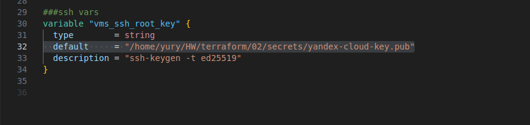  
 
2. Создадим в Yandex-cloud сервисный аккаунт и ключ, скачаем ключ, поместим его в директоию `secrets`.
   
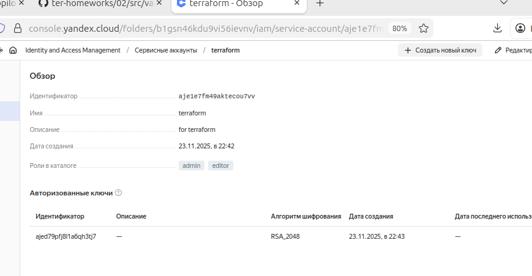 

В файле `providers.tf` в блоке `provider "yandex"` укажем путm на скачанный ключ.   
`service_account_key_file = file("/home/yury/HW/terraform/02/secrets/authorized_key.json")`  

4. Используем текущий SSH-ключ. Ранее путь к нему указали в файле `variables.tf`.

5. Попробуем инициализировать проект (init, validate, plan). Исправим ошибки:    
   - желаемой версии terraform на `required_version = "~> 1.13.4"`;  
  
 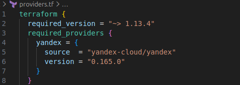   

  - наименование и типа создаваемой ВМ, числа ядер доли процессора, путь к SSH-ключу.
  
 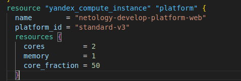
 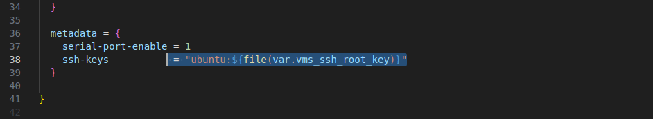
  
6. Проверим создание ВМ в консоли.    
   
   

Зайдем на ВМ.    
`ssh -i /home/yury/HW/terraform/02/secrets/yandex-cloud-key ubuntu@158.160.48.44`  

 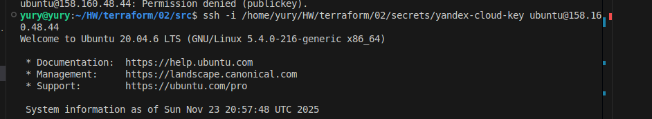  

Выполним команду `curl ifconfig.me`.  

 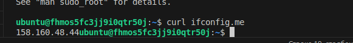  

8. Ответы на вопросы:  
`preemptible = true`  - параметр, отвечающий за прерывание работы ВМ через 24 часа;  
`core_fraction=50` - параметр, отвечающий за объем использования процессора (20,50 или 100).  
 Используя эти параметры, можно экономить денежные средства.

---


### Задание 2

1. Замените все хардкод-**значения** для ресурсов **yandex_compute_image** и **yandex_compute_instance** на **отдельные** переменные. К названиям переменных ВМ добавьте в начало префикс **vm_web_** .  Пример: **vm_web_name**.
2. Объявите нужные переменные в файле variables.tf, обязательно указывайте тип переменной. Заполните их **default** прежними значениями из main.tf. 
3. Проверьте terraform plan. Изменений быть не должно. 

**Решение**

Уберем хард-код из `main.tf`, oбъявив переменные в файле `variables.tf`. Проверим (plan, apply).  

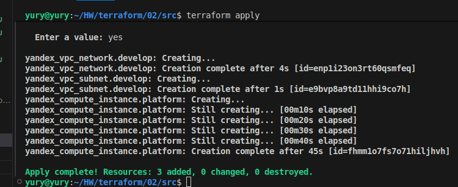  
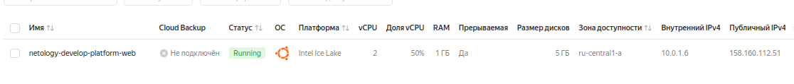 

---


### Задание 3

1. Создайте в корне проекта файл 'vms_platform.tf' . Перенесите в него все переменные первой ВМ.
2. Скопируйте блок ресурса и создайте с его помощью вторую ВМ в файле main.tf: **"netology-develop-platform-db"** ,  ```cores  = 2, memory = 2, core_fraction = 20```. Объявите её переменные с префиксом **vm_db_** в том же файле ('vms_platform.tf').  ВМ должна работать в зоне "ru-central1-b"
3. Примените изменения.


**Решение**

Для решения задания  была создана подсеть в зоне "b".

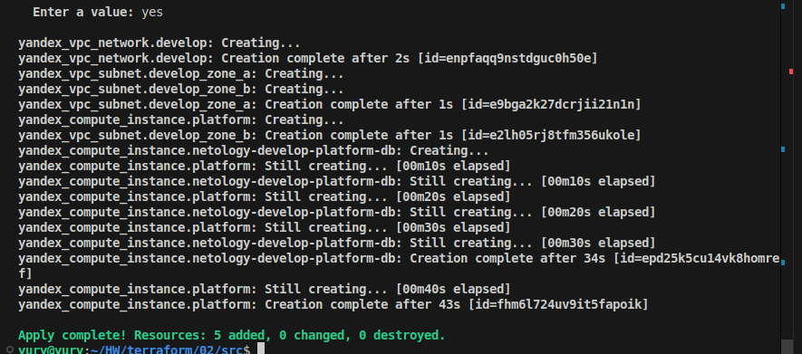  
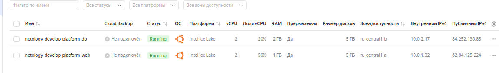 

---


### Задание 4

1. Объявите в файле outputs.tf **один** output , содержащий: instance_name, external_ip, fqdn для каждой из ВМ в удобном лично для вас формате.(без хардкода!!!)
2. Примените изменения.

В качестве решения приложите вывод значений ip-адресов команды ```terraform output```.


**Решение**

```
output "vm_instances" {
  description = "Information about all VM instances"
  value = {
    web = {
      instance_name = yandex_compute_instance.platform.name
      external_ip   = yandex_compute_instance.platform.network_interface[0].nat_ip_address
      fqdn          = yandex_compute_instance.platform.fqdn
    }
    db = {
      instance_name = yandex_compute_instance.netology-develop-platform-db.name
      external_ip   = yandex_compute_instance.netology-develop-platform-db.network_interface[0].nat_ip_address
      fqdn          = yandex_compute_instance.netology-develop-platform-db.fqdn
    }
  }
}
```

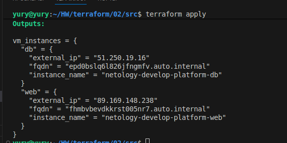  
 
---


### Задание 5

1. В файле locals.tf опишите в **одном** local-блоке имя каждой ВМ, используйте интерполяцию ${..} с НЕСКОЛЬКИМИ переменными по примеру из лекции.
2. Замените переменные внутри ресурса ВМ на созданные вами local-переменные.
3. Примените изменения.


**Решение**

Исправим main.tf.  
Опишем название каждой ВМ в locals.tf.  

```
locals {
  # Формируем имена ВМ с помощью интерполяции
  vm_web_name = "web-${var.vm_web_zone}-${var.vm_web_memory}gb"
  vm_db_name  = "db-${var.vm_db_zone}-${var.vm_db_memory}gb"
}
```

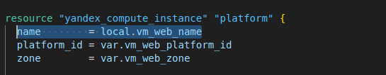  
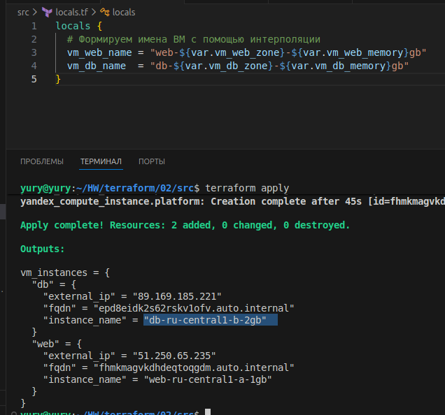 

---


### Задание 6

1. Вместо использования трёх переменных  ".._cores",".._memory",".._core_fraction" в блоке  resources {...}, объедините их в единую map-переменную **vms_resources** и  внутри неё конфиги обеих ВМ в виде вложенного map(object).  
   ```
   пример из terraform.tfvars:
   vms_resources = {
     web={
       cores=2
       memory=2
       core_fraction=5
       hdd_size=10
       hdd_type="network-hdd"
       ...
     },
     db= {
       cores=2
       memory=4
       core_fraction=20
       hdd_size=10
       hdd_type="network-ssd"
       ...
     }
   }
   ```
3. Создайте и используйте отдельную map(object) переменную для блока metadata, она должна быть общая для всех ваших ВМ.
   ```
   пример из terraform.tfvars:
   metadata = {
     serial-port-enable = 1
     ssh-keys           = "ubuntu:ssh-ed25519 AAAAC..."
   }
   ```  
  
5. Найдите и закоментируйте все, более не используемые переменные проекта.
6. Проверьте terraform plan. Изменений быть не должно.


**Решение**

Создадим единую map-переменную **vms_resources**,  внутри неё конфиги обеих ВМ в виде вложенного map(object) и укажем её в variables.tf.  
Также в variables.tf укажем общую метаданную.  
SSH-ключ из соображений безопасности не будем показывать в открытом виде.  
Закомментируем дублирующий код в main.tf, variables.tf.   
Изменим locals.tf, так как название теперь подтягивается из блоков map-переменных.    
Развернем проект.

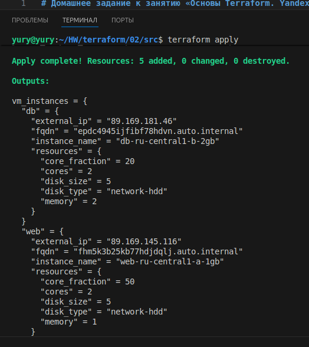  
 
---

## Дополнительное задание (со звёздочкой*)

**Настоятельно рекомендуем выполнять все задания со звёздочкой.**   
Они помогут глубже разобраться в материале. Задания со звёздочкой дополнительные, не обязательные к выполнению и никак не повлияют на получение вами зачёта по этому домашнему заданию. 


------
### Задание 7*

Изучите содержимое файла console.tf. Откройте terraform console, выполните следующие задания: 

1. Напишите, какой командой можно отобразить **второй** элемент списка test_list.
2. Найдите длину списка test_list с помощью функции length(<имя переменной>).
3. Напишите, какой командой можно отобразить значение ключа admin из map test_map.
4. Напишите interpolation-выражение, результатом которого будет: "John is admin for production server based on OS ubuntu-20-04 with X vcpu, Y ram and Z virtual disks", используйте данные из переменных test_list, test_map, servers и функцию length() для подстановки значений.

**Примечание**: если не догадаетесь как вычленить слово "admin", погуглите: "terraform get keys of map"

В качестве решения предоставьте необходимые команды и их вывод.

**Решение**

Используем тестовый файл `сonsole.tf`.   
1. Откроем terraform console.  
`terraform console`  
введем команду  
`local.test_list[1]`    
2. Найдем длину списка `test_list`.    
`length(local.test_list)`  
3. Отобразим значение ключа admin из `map   test_map`.   
`local.test_map["admin"]`  
4. Напишем Interpolation-выражение.  
`format("%s is admin for production server based on OS %s with %d vcpu, %d ram and %d virtual disks", local.test_map["admin"], local.servers["production"].image, local.servers["production"].cpu, local.servers["production"].ram, length(local.servers["production"].disks))`  

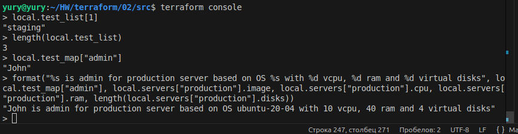  
 
---


### Задание 8*
1. Напишите и проверьте переменную test и полное описание ее type в соответствии со значением из terraform.tfvars:
```
test = [
  {
    "dev1" = [
      "ssh -o 'StrictHostKeyChecking=no' ubuntu@62.84.124.117",
      "10.0.1.7",
    ]
  },
  {
    "dev2" = [
      "ssh -o 'StrictHostKeyChecking=no' ubuntu@84.252.140.88",
      "10.0.2.29",
    ]
  },
  {
    "prod1" = [
      "ssh -o 'StrictHostKeyChecking=no' ubuntu@51.250.2.101",
      "10.0.1.30",
    ]
  },
]
```
2. Напишите выражение в terraform console, которое позволит вычленить строку "ssh -o 'StrictHostKeyChecking=no' ubuntu@62.84.124.117" из этой переменной.

**Решение**

1. Создадим переменную test в variablеs.tf

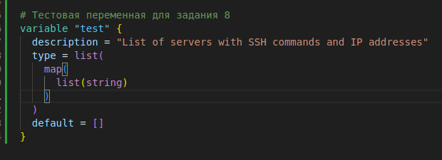   

2. Внесем тестовые значения в terraform.tfvars.  
3. Напишем выражение в terraform console.  
`var.test[0]["dev1"][0]`  
 
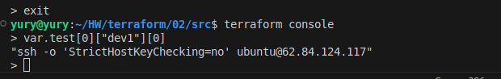 

---


### Задание 9*

Используя инструкцию https://cloud.yandex.ru/ru/docs/vpc/operations/create-nat-gateway#tf_1, настройте для ваших ВМ nat_gateway. Для проверки уберите внешний IP адрес (nat=false) у ваших ВМ и проверьте доступ в интернет с ВМ, подключившись к ней через serial console. Для подключения предварительно через ssh измените пароль пользователя: ```sudo passwd ubuntu```


**Решение**

Cконфигурируем новые сетевые ресурсы в main.tf-файле.
Исправим сведения о сетях в variables.tf. 
`nat=false  `

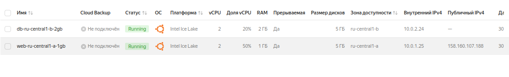  
 


Задание в работе....


